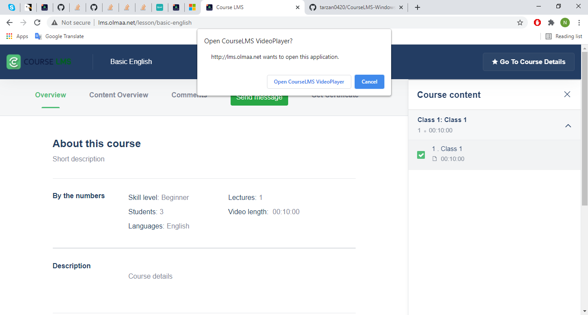
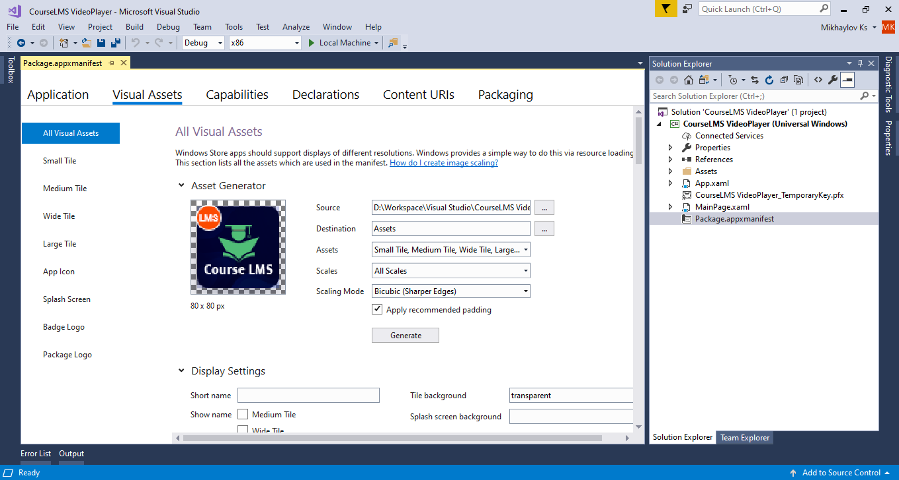
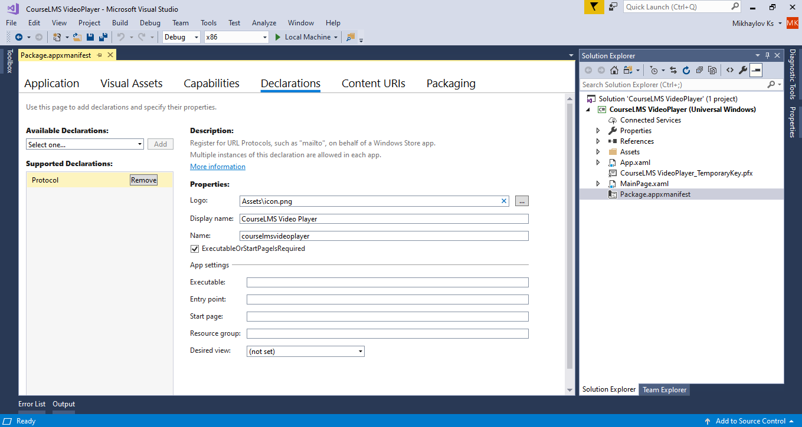
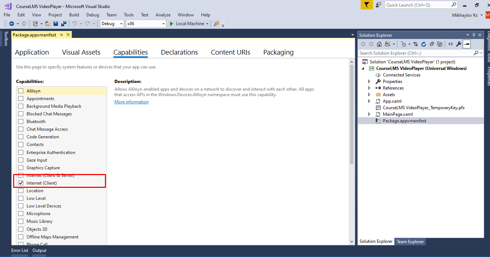

# CourseLMS-Windows-VideoPlayer

This Windows  app was developed on Visual Studio 2017 using UWP.

This app runs as a video player for http://lms.olmaa.net/ with special features like disabling screen capture and be opened from web browser.

